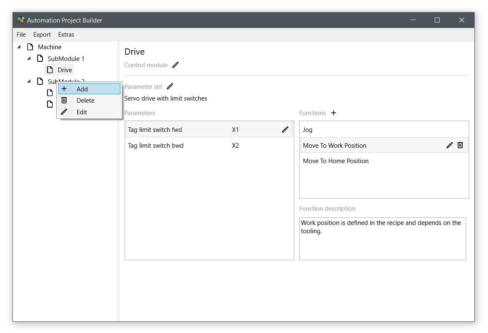

[](LICENSE)

# AutomationProjectBuilder
This is a draft application for PLC code generation according to IEC61131-10 and ISA-88. With simple operations a project structure following the concepts of ISA-88 can be assembled and filled with details. This structure can then be translated to a set of PLC function blocks in XML format as specified in IEC61131-10. This application is build on .NET Core 3.1.



:warning: This application is very much incomplete and needs further customization.

## Architecture
The application is split in three major components:

* Data
* Export to XML
* Graphical user interface

GUI and export are independant and can be edited separatly. Base only serves as an entry point where everything is wired up, additionally the consol could be utilized as a logger output window.

## Custom parameter
The application already allows the association of a set of custom parameters to each module, that can be saved and utilized during code generation. These parameter sets are taken from a predefined configuration that is pointed to in the settings dialog. This configuration is also a XML structure, that is expected to e.g. like this:

```
<?xml version="1.0" encoding="utf-8"?>
<CustomConfiguration>
  <ConfigurationGroup Name="Parameter group 1">
    <Configuration Name="Parameter set 1">
      <Parameters>
        <Parameter Name="My first parameter"/>
        <Parameter Name="My second parameter"/>
      </Parameters>
    </Configuration>
    <Configuration Name="Parameter set 2">
      <Parameters>
        <Parameter Name="My first parameter"/>
        <Parameter Name="My second parameter"/>
      </Parameters>
    </Configuration>
  </ConfigurationGroup>
  <ConfigurationGroup Name="Parameter group 2">
    <Configuration Name="Parameter set 1">
      <Parameters>
        <Parameter Name="My first parameter"/>
        <Parameter Name="My second parameter"/>
      </Parameters>
    </Configuration>
  </ConfigurationGroup>
</CustomConfiguration>
```

This configuration is only necessary when defining a new module or changing a parameter set for a module.

## Custom file format
Project structures created can be saved to or read from a simple XML structure, that looks like this:

```
<?xml version="1.0" encoding="utf-8"?>
<Module Name="Main module" Type="ProcessCell">
  <SubModules>
    <Module Name="SubModule 1" Type="EquipmentModule">
      <SubModules>
        <Module Name="Drive" Type="CtrlModule">
          <SubModules />
          <Functions>
            <Function Name="First function" Description="Text" />
            <Function Name="Second function" Description="Text" />
          </Functions>
          <Parameters Group="Parameter group 1" Set="Parameter set 2">
            <Parameter Name="My first parameter">Value1</Parameter>
            <Parameter Name="My second parameter">Value2</Parameter>
          </Parameters>
        </Module>
      </SubModules>
      <Functions />
      <Parameters Group="" Set="" />
    </Module>
  </SubModules>
  <Functions />
  <Parameters Group="" Set="" />
</Module>
```

## Contact
If you are interested in extending this to a full application and you have questions or suggestions on improving this, let me know! :man_cartwheeling:

## License
```
MIT License

Copyright (c) 2020 Andreas Seutemann

Permission is hereby granted, free of charge, to any person obtaining a copy
of this software and associated documentation files (the "Software"), to deal
in the Software without restriction, including without limitation the rights
to use, copy, modify, merge, publish, distribute, sublicense, and/or sell
copies of the Software, and to permit persons to whom the Software is
furnished to do so, subject to the following conditions:

The above copyright notice and this permission notice shall be included in all
copies or substantial portions of the Software.

THE SOFTWARE IS PROVIDED "AS IS", WITHOUT WARRANTY OF ANY KIND, EXPRESS OR
IMPLIED, INCLUDING BUT NOT LIMITED TO THE WARRANTIES OF MERCHANTABILITY,
FITNESS FOR A PARTICULAR PURPOSE AND NONINFRINGEMENT. IN NO EVENT SHALL THE
AUTHORS OR COPYRIGHT HOLDERS BE LIABLE FOR ANY CLAIM, DAMAGES OR OTHER
LIABILITY, WHETHER IN AN ACTION OF CONTRACT, TORT OR OTHERWISE, ARISING FROM,
OUT OF OR IN CONNECTION WITH THE SOFTWARE OR THE USE OR OTHER DEALINGS IN THE
SOFTWARE.
```
